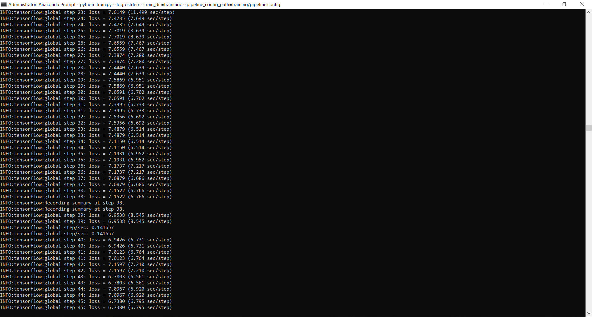
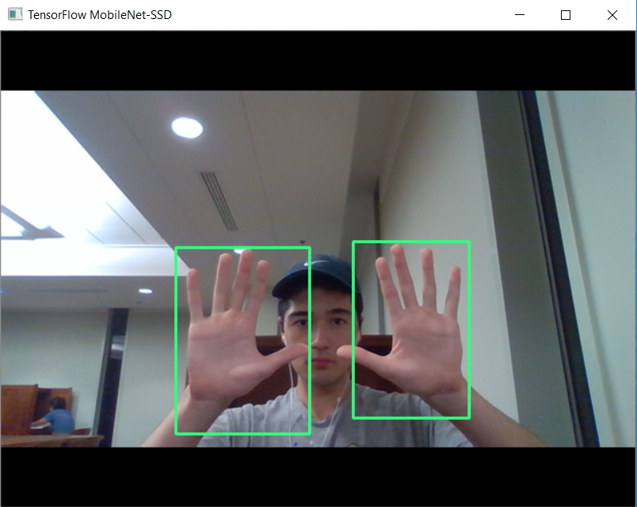

# Dynamic Hand Recognition Drawing Program
A program that uses machine learning to detect hands from a streaming input from a camera and uses the location of the hand to draw on a whiteboard.

There is a solution file for visual studio (the IDE used for this project). The python scripts are also in the repository.

<h2>Getting Started</h2>

This project was just a way for me to become more comfortable with machine learning, specifically with TensorFlow.
All testing was done on the Anaconda environment(python 3.7).
I downloading the following libraries:
  numpy,
  opencv,
  TensorFlow,
  pandas

I downloaded the Egohands data that contained 4,800 images of hands in many different environments. These images were to be used to train the machine learning model.

I used [datitran](http://github.com)'s xml_to_csv.py and generate_tfrecord.py to convert the data to TensorFlow format with help from [Victor Dibia](https://github.com/victordibia/)'s script.

I chose to use the SSD_MobileNet_v1_coco model from the [Detection Model Zoo](https://github.com/tensorflow/models/blob/master/research/object_detection/g3doc/detection_model_zoo.md#coco-trained-models-coco-models) from TensorFlow because it allowed me to skip a lot of training by using previously made [bottlenecks](https://ai.stackexchange.com/questions/4864/what-is-the-concept-of-tensorflow-bottlenecks). I edited the .config files and moved directories around. Then I started to train the model.

However, I realized that the training would take too long to get a fully training model that is functional, so I considered cloud GPUs. However, I wanted to keep this project expense-free, so I decided to continue with Dibia's frozen_inference_graph.pb file. However, all steps for training were completed, thus completing the learning experience.

<h2>Program Designing</h2>

I wanted to use a python library that would allow me to take inputs(arrays that correspond to images) from the built-in webcam on my computer and OpenCV allowed me to do this. After looking on the OpenCV tutorials for a significant amount of time, I developed a script that ran and displayed the a video from the webcam.

Then using TensorFlow, I implemented the object detection to just a single image that the webcam took.

Next, I edited the script to run continuously and to display all of the images that it inputs (as a video does).

I created a "whiteboard" in the same size of the webcam's input (will correspond to the size of whichever camera is the main device). On this, a script was developed quickly to draw lines based on the locations of the biggest detected hand.

<h2>Takeaways</h2>

I learned a lot about terminals and machine learning. There is a really good [explanation](https://youtu.be/2-Ol7ZB0MmU) by Luis Serrano of convolutional neural networks, from which I learned how CNNs worked. Image data structures and editing also became more familiar as a result of this project.

<h2>Acknowledgements:</h2>

Victor Dibia, Real-time Hand-Detection using Neural Networks (SSD) on Tensorflow, (2017), GitHub repository, https://github.com/victordibia/handtracking

<i>Dibia's frozen_inference_graph.pb is in the repository and was used in this project. See above.</i>

Egohands Dataset

The tensorflow custom object detection guides by Harrison from pythonprogramming and Dat Tran 

TensorFlow tutorials and Object Detection API

OpenCV tutorials

<i>I do not claim ownership of this idea, as this type of program has been created before. This project was for personal educational purposes only.</i>
